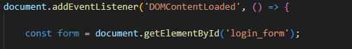
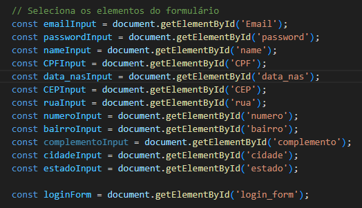
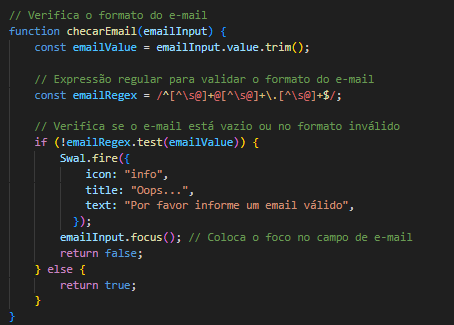
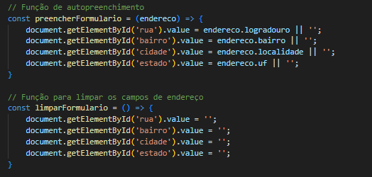
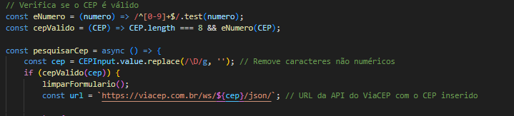
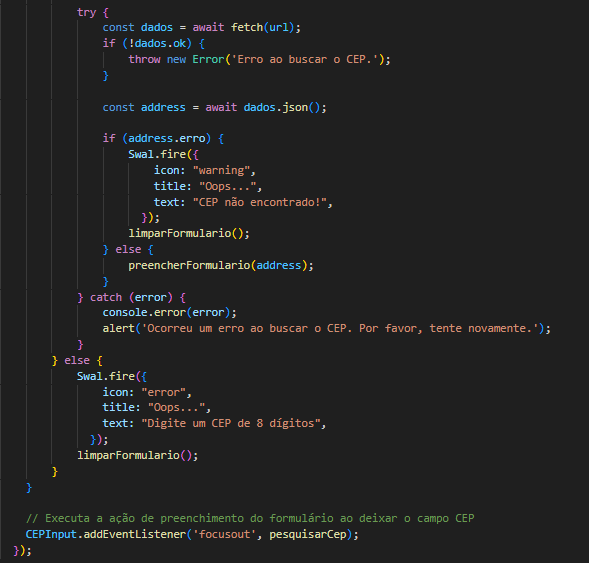
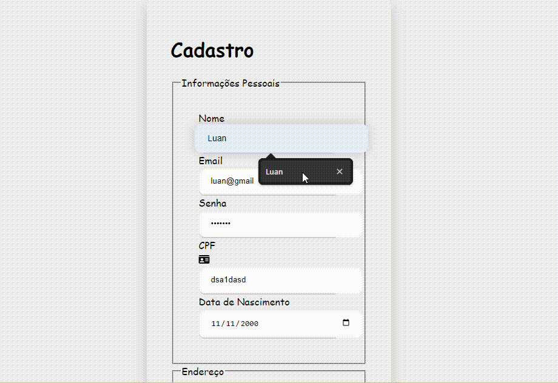

# Indice
[funcionalidades](#funcionalidades)

[codigos](#codigos)

[funcoes](#funções)

[tecnologias_utilizadas](#tecnologias-utilizadas)

[gif_demonstrativo](#gif-demonstrativo)

[autor](#autor)

## Funcionalidades

 Este projeto permite consultar o CEP de um endereço e preencher automaticamente os campos de rua, bairro, cidade e estado.

* **Consulta à API ViaCEP:** Utiliza a API ViaCEP para obter os dados do endereço.
* **Validação de CEP:** Verifica se o CEP informado é válido.
* **Preenchimento automático do formulário:** Preenche os campos do formulário com os dados retornados pela API.
* **Modo claro/escuro:** Permite alternar entre o modo claro e escuro.

## Codigos:

##### document.addEventListener('DOMContentLoaded', () => { ... }):
    Esta linha anexa um ouvinte de evento ao objeto document, que é o elemento raiz do documento HTML.

##### const form = document.getElementById('login_form');:
    Similar à linha anterior, esta cria uma variável constante chamada form e atribui a ela o valor do elemento HTML com o ID login_form.

##### const 

    const é utilizado para declarar constantes, ou seja, variáveis cujo valor não pode ser alterado após a sua inicialização. Isso é uma boa prática para evitar erros de atribuição acidental.

##### getElementById

    Essa função é usada para obter um elemento do DOM (Document Object Model) com base no seu ID. O ID é um atributo único que identifica um elemento HTML.

##### loginForm.addEventListener:

    Adiciona um ouvinte de evento ao elemento HTML com o ID "login_form".

##### 'submit':

    Especifica que o evento a ser escutado é o evento de envio do formulário.

##### (event) => { ... }:

    É uma função de callback que será executada quando o evento de envio ocorrer. O parâmetro event contém informações sobre o evento.

##### const requiredFields = [...]:

    Cria um array contendo todas as referências aos elementos de input que são considerados obrigatórios. Esses elementos foram previamente selecionados e armazenados em constantes (não mostradas no código fornecido).

##### for (let field of requiredFields) { ... }:

###### for...of:

    Um loop que itera sobre cada elemento do array requiredFields.

###### field:

    Em cada iteração, field representa um dos elementos de input.

**#####if (field.value.trim() === ''):**

**######field.value:** Obtém o valor atual do campo de input.

**#####.trim():** Remove espaços em branco no início e no final do valor.

**#####=== '':** Verifica se o valor, após remover os espaços em branco, é uma string vazia.

##### event.preventDefault():

    Impede que o comportamento padrão do evento de envio ocorra. Isso significa que o formulário não será enviado para o servidor.

###### Swal.fire({ ... }):

    Exibe um alerta (sweet alert) para o usuário, informando que ele precisa preencher todos os campos.

**######icon: "info":**  Define o ícone do alerta como um ícone de informação.
**######title:** "Oops...": Define o título do alerta.
**######text:** "Por favor preencha todos os campos": Define o corpo da mensagem do alerta.

###### field.focus():

    Define o foco no campo de input atual, permitindo que o usuário corrija o valor.

### FUNÇÕES:

#### checarEmail(emailInput): 

    Esta função (não mostrada no código) é responsável por verificar se o formato do e-mail inserido é válido. Ela provavelmente utiliza uma expressão regular para comparar o valor do campo com um padrão de e-mail.

###### !checarEmail(...):

    A negação indica que se a função checarEmail retornar false (indicando um e-mail inválido), o código dentro do ifserá executado.

###### event.preventDefault():

     Impede o envio padrão do formulário, evitando que os dados sejam enviados para o servidor com um e-mail inválido.

###### return;:

     Interrompe a execução da função, garantindo que o código abaixo não seja executado.

#### validarCPF(CPFInput.value):

     Esta função (também não mostrada) é responsável por verificar se o CPF inserido é válido, utilizando algum algoritmo de validação de CPF.
    

###### !validarCPF(...):**

    Se a função validarCPF retornar false (CPF inválido), o código dentro do if será executado.

###### event.preventDefault():

    Assim como na validação do e-mail, impede o envio do formulário.

###### Swal.fire(...):

    Exibe um alerta (usando a biblioteca SweetAlert2) informando ao usuário que o CPF é inválido.

###### CPFInput.focus():*

    Coloca o foco no campo de CPF para que o usuário possa corrigir o valor.

##### Remoção de caracteres não numéricos:

    cpf = cpf.replace(/[^\d]+/g, "");: Essa linha remove todos os caracteres que não são números do CPF, deixando apenas os dígitos. Isso é importante para garantir que o cálculo seja feito apenas com os números do CPF.

##### Verificação de tamanho e formato básico:

    if (cpf.length !== 11 || /^(\d)\1{10}$/.test(cpf)) { return false; }: Essa linha verifica se o CPF tem 11 dígitos e se todos os dígitos são iguais. Se alguma dessas condições for verdadeira, o CPF é considerado inválido e a função retorna false.

##### Cálculo do primeiro dígito verificador:

**Inicialização:**

    As variáveis soma e resto são inicializadas para realizar os cálculos.

**Loop:** 

    Um loop for percorre cada um dos 9 primeiros dígitos do CPF.

**Cálculo da soma:** 

    Em cada iteração, o dígito atual é multiplicado por um peso que vai diminuindo de 11 para 2 e a soma é acumulada.

**Cálculo do resto:**

    O resto da divisão da soma por 11 é calculado.

**Verificação do dígito:** 

    O resto é comparado com o décimo dígito do CPF. Se forem diferentes, o CPF é inválido.

##### Cálculo do segundo dígito verificador:

**Inicialização:** 

    A variável soma é reinicializada.

**Loop:** 

    Um loop for percorre cada um dos 10 primeiros dígitos do CPF.

**Cálculo da soma:** 

    Em cada iteração, o dígito atual é multiplicado por um peso que vai diminuindo de 12 para 2 e a soma é acumulada.

**Cálculo do resto:** 

    O resto da divisão da soma por 11 é calculado.

**Verificação do dígito:** 

    O resto é comparado com o décimo primeiro dígito do CPF. Se forem diferentes, o CPF é inválido.

**Retorno:** 

    Se todos os cálculos forem realizados com sucesso e os dígitos verificadores estiverem corretos, a função retorna true, indicando que o CPF é válido.

**Expressões Regulares:** 

    A expressão regular /^(\d)\1{10}$/ verifica se todos os dígitos do CPF são iguais, o que é um caso inválido de CPF.

##### function checarEmail(emailInput) { ... }:

    function checarEmail: Define uma função chamada checarEmail que recebe como parâmetro um elemento de input (geralmente um campo de texto) onde o usuário insere o e-mail.

##### const emailValue = emailInput.value.trim();:

**emailInput.value:**

     Obtém o valor (texto) inserido pelo usuário no campo de e-mail.

**.trim():** 

    Remove espaços em branco no início e no final da string, garantindo que a validação seja feita apenas sobre o texto relevante.

**const emailValue:** 

    Armazena o valor do e-mail sem espaços em branco em uma constante para facilitar o uso posterior.

##### const emailRegex = /^[\w-\.]+@([\w-]+\.)+[\w-]{2,4}$/:

**const emailRegex:** 

    Define uma expressão regular para validar o formato do e-mail.

**^[\w-\.]+@:** 

    Verifica se o e-mail começa com uma sequência de letras, números, underscores (_) ou hífens (-), seguida pelo símbolo @.

**([\w-]+\.)+:** 

    Verifica se o nome do domínio contém pelo menos um ponto (.) e é composto por letras, números, underscores ou hífens.

**[\w-]{2,4}$:** 

    Verifica se a extensão do domínio (TLD) tem entre 2 e 4 caracteres (por exemplo, .com, .br).

##### if (!emailRegex.test(emailValue)) { ... }:

**emailRegex.test(emailValue):**

    Verifica se a string emailValue corresponde ao padrão definido pela expressão regular.

**!:** 

    Nega o resultado, ou seja, se a expressão regular não encontrar uma correspondência, a condição será verdadeira.

**Bloco if:**

    Se o e-mail não for válido, o código dentro do bloco if é executado.

###### Dentro do bloco if:

**Swal.fire(...):**  

    Exibe um alerta usando a biblioteca SweetAlert2, informando ao usuário que o e-mail é inválido.

**emailInput.focus():**  

    Coloca o foco no campo de e-mail para que o usuário possa corrigir o valor.

**return false;:**  

    Retorna false, indicando que a validação falhou.

**else { return true; }:** 

    Se o e-mail for válido, o código fora do bloco if é executado, retornando true.

##### preencherFormulario:

    Preenche automaticamente os campos de um formulário com dados de um objeto
    A função recebe um objeto endereco como parâmetro. Esse objeto deve conter propriedades como logradouro, bairro, cidade e uf (unidade federativa), que correspondem aos valores que serão preenchidos nos campos do formulário.
    A função recebe um objeto endereco como parâmetro. Esse objeto deve conter propriedades como logradouro, bairro, cidade e uf (unidade federativa), que correspondem aos valores que serão preenchidos nos campos do formulário.

**document.getElementById():**
    
    Para selecionar os elementos HTML com os IDs rua, bairro, cidade e estado. Esses elementos provavelmente são campos de input (como campos de texto) em um formulário.

**value:**

    É definido com base nas propriedades correspondentes do objeto endereco. O operador || '' garante que, se uma propriedade do objeto endereco não estiver definida ou tiver um valor null ou undefined, um valor vazio será atribuído ao campo.

##### limparFormulario:

    Esta função tem como objetivo limpar os campos de um formulário, ou seja, remover qualquer valor preenchido anteriormente.

**Seleciona os elementos:**

    Assim como na função anterior, a função seleciona os elementos HTML com os IDs rua, bairro, cidade e estado.

**Atribui valor vazio:**

     O valor da propriedade value de cada elemento é definido como uma string vazia (""), removendo qualquer conteúdo anterior.

#####const eNumero = (numero) => /^[0-9]+$/.test(numero);:

**eNumero:**
    
     Uma função que verifica se uma string contém apenas números.

#### /^[\d]+$/.test(numero):

     Utiliza uma expressão regular para testar se a string numero contém apenas dígitos de 0 a 9. O ^ e o $ garantem que a expressão se aplique à string inteira, e o \d+ significa um ou mais dígitos.

#### const cepValido = (CEP) => CEP.length === 8 && eNumero(CEP);:

**cepValido:**

    Uma função que verifica se um CEP é válido.

**CEP.length === 8:** 

    Verifica se o CEP tem exatamente 8 dígitos.

**eNumero(CEP):** 

    Chama a função eNumero para verificar se todos os caracteres do CEP são números.

**const pesquisarCep = async () => { ... }:**

**async:** 

    Indica que a função é assíncrona, permitindo realizar operações que podem levar tempo, como chamadas a APIs.

**CEPInput.value.replace(/\D/g, ''):**

    Obtém o valor do campo de input com o ID "CEPInput", remove todos os caracteres que não são números e armazena o resultado em cep.

**if (cepValido(cep)) { ... }:**

    Verifica se o CEP é válido antes de realizar a consulta à API.

**const url = https://viacep.com.br/ws/${cep}/json/:**

    Constrói a URL da API do ViaCEP, substituindo {cep} pelo valor do CEP.

**Chamada à API:**
    
    A parte da chamada à API (não mostrada no código) provavelmente utiliza o fetch ou uma biblioteca como axios para fazer a requisição HTTP e obter os dados do endereço.

###### try...catch
**try:**

    Envolve o bloco de código que pode gerar erros, como a requisição à API.

**catch:**

    Captura qualquer erro que ocorrer dentro do bloco try e executa o código dentro deste bloco.

**try:**

**const dados = await fetch(url);:**

    Realiza uma requisição à API utilizando a função fetch.
    Aguarda a resposta da API e armazena os dados em dados.

**if (!dados.ok):**

    Verifica se a requisição foi bem-sucedida. Se não, lança um erro.

**const address = await dados.json();:**

    Converte os dados da resposta da API para um objeto JavaScript e armazena em address.

**if (address.erro):**

    Verifica se a API retornou um erro (por exemplo, CEP não encontrado).
    Se houver erro, exibe um alerta usando SweetAlert2.

**limparFormulario():** 

    Limpa os campos do formulário caso o CEP não seja encontrado.

**preencherFormulario(address);:**

    Preenche os campos do formulário com os dados do endereço retornado pela API.

**catch**

**console.error(error);:**

     Registra o erro no console para fins de depuração.

**alert('Ocorreu um erro ao buscar o CEP. Por favor, tente novamente.');:**

     Exibe um alerta genérico para o usuário informando sobre o erro.

#### try...catch

**else:** 

    Executado se o CEP não for válido (menos de 8 dígitos).

**Swal.fire(...):** 

    Exibe um alerta informando que o CEP digitado é inválido.

**limparFormulario():** 

    Limpa os campos do formulário.

## Tecnologias utilizadas:

* [<code></code>](https://developer.mozilla.org/pt-BR/docs/Web/HTML)
* [<code></code>](https://github.com/)
* [<code></code>](https://git-scm.com/)
* [<code></code>](https://code.visualstudio.com/)
* [<code></code>](https://fontawesome.com/versions)
 
## gif demonstrativo:

## Autor:
|  [ Luan Alencar](https://github.com/luan18alencar) |  
| :---: |
